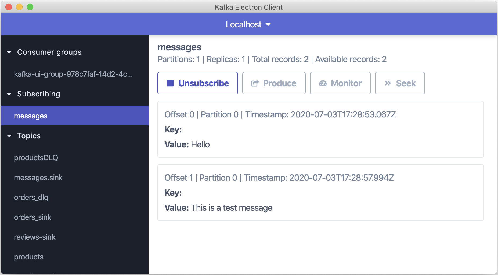

# Kafka Electron Client

A simple Kafka client for consuming / producing Kafka records, checking offsets etc. Not by any means full featured, and still very much work in progress. Use at your own risk :)

## Development

### Prerequisites

- Yarn
- Node.js
- Kotlin (for developing the backend that talks to Kafka)
- Java (for building and running the backend JAR)

### Running development environment

1. Build backend JAR by running `./backend/gradlew --project-dir backend shadowJar`
1. Run the development environment for Electron app with `yarn electron-dev`

This will start Overmind developer tools, spawn the backend process and open the Electron app.

## Releasing

This project uses GitHub actions to build and release the app.

Following flow should be used with releases:

1. On each change, Electron Builder will automatically publish binaries to a draft release with version tag corresponding to the package.json version.
1. When ready to actually release, just publish the draft and bump package.json version again to start working on next release.
